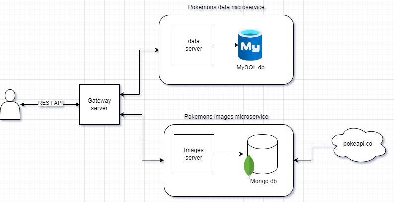
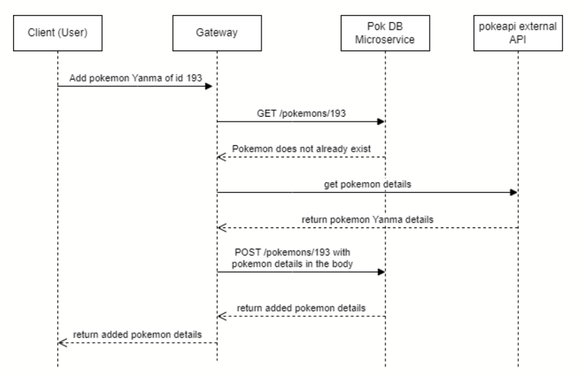

# Pokemon Corp API

## Demo
Check out a working demo [here](https://pokecorp-gateway-73dd8185d4ab.herokuapp.com/)

## Pokemon data Microservice repo:
https://github.com/tareknatsheh/PokeCorp-DB-microservice

## Pokemon images Microservice repo:
https://github.com/tareknatsheh/PokeCorp-images-microservice

## Block Diagram


## Use case
Here is a sequence diagram of an example of adding a new pokemon to the database


## Quick Start
Install all requirements
```bash
pip install -r requirements.txt
```
Run the server
```bash
uvicorn app:app --reload
```
You can find the endpoints and their documentation (by swagger) at
http://127.0.0.1:8000/docs/

### Run tests
You can run the available tests by executing this command:
```bash
python -m pytest
```

### TODO
- Add in memory caching or Redis and client caching
- Add authentication and authorization endpoints
- Add better logging, and explore tools like Grafana
- Research other options for storing images

## Ideas for scalability
- A message broker like KAFKA
- Load balancing across all microservices
- Auto scaling by cloud services providers
- CDN like cloudfront for the images
